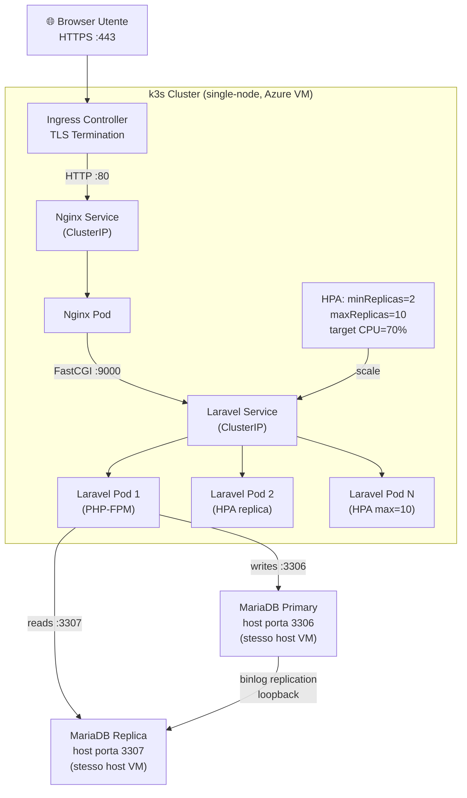

# Design Document — TechFix Cloud-Native Migration

## Overview

TechFix è un'applicazione web Laravel 10 monolitica che gestisce l'assistenza tecnica post-vendita. Attualmente gira su un singolo server con un database MySQL condiviso. Questo documento descrive l'architettura cloud-native target e le decisioni tecniche per migrarla su OpenNebula + Kubernetes.

### Obiettivi della migrazione

- Containerizzare l'applicazione con Docker multi-stage (Nginx + PHP-FPM)
- Orchestrare i container tramite Kubernetes su VM OpenNebula
- Introdurre scalabilità orizzontale automatica (HPA) per gestire picchi di carico
- Separare i workload di lettura/scrittura con MySQL Primary + Replica su VM dedicate
- Hardening della sicurezza: SecurityContext, NetworkPolicy, K8s Secrets + etcd encryption at rest, TLS su Ingress

### Stack tecnologico

| Layer | Tecnologia | Ruolo |
|---|---|---|
| IaaS | OpenNebula (concettuale) / Azure VM (deployment reale) | Infrastruttura di hosting — singola VM Ubuntu 24.04 (4 vCPU, 15 GB RAM) |
| Orchestrazione | k3s | Distribuzione Kubernetes leggera, adatta a single-node |
| Runtime container | Docker (multi-stage) | Build e packaging dell'applicazione |
| App server | PHP-FPM 8.1 | Esecuzione business logic Laravel |
| Web server | Nginx | Reverse proxy, TLS termination interna, file statici |
| Ingress | Traefik (integrato in k3s) | Terminazione TLS, redirect HTTP→HTTPS |
| Database | MariaDB 10.4 Primary + Replica | Persistenza dati, read/write split — installati direttamente sulla VM (fuori dal cluster k3s) |
| Autoscaling | Kubernetes HPA | Scaling automatico pod Laravel in base a CPU |
| Secrets | Kubernetes Secrets + etcd aescbc | Gestione credenziali cifrata |

> **Nota sul deployment reale vs architettura del corso:** Il progetto usa OpenNebula come layer IaaS concettuale (documentato nel design e nella relazione). Il deployment pratico avviene su una singola VM Azure Ubuntu 24.04. k3s sostituisce kubeadm per ridurre l'overhead del control plane su una singola macchina con risorse condivise. MariaDB 10.4 Primary e Replica girano come processi separati sulla stessa VM (porte 3306 e 3307) — il principio architetturale "database fuori dal cluster K8s" rimane valido. Il database esistente (`grp_61_db`) viene importato tramite dump SQL.


---

## Architecture

### Diagramma ad alto livello

```
                 ┌──────────────────────────────────────────────────────────────────┐
                 │              Azure VM Ubuntu 24.04 (4 vCPU, 15 GB RAM)           │
                 │          (rappresenta la VM OpenNebula nel contesto del corso)   │
                 │                                                                  │
  [Browser]      │  ┌──────────────────────────────────────────────────────────┐   │
     │           │  │              k3s Cluster (single-node)                   │   │
     │ HTTPS:443  │  │                                                          │   │
     ▼           │  │  ┌──────────────────────────────────────────────────┐    │   │
  Traefik        │  │  │  Namespace: techfix                              │    │   │
  Ingress ───────────▶  │                                                  │    │   │
  (TLS term.)   │  │  │  ┌──────────┐   FastCGI:9000   ┌─────────────┐  │    │   │
     │           │  │  │  │ Nginx   │ ─────────────────▶│ Laravel Pod │  │    │   │
     │ HTTP:80   │  │  │  │  Pod    │                   │  (PHP-FPM)  │  │    │   │
     └──────────────▶  │  └──────────┘                   └──────┬──────┘  │    │   │
                 │  │  │                                         │         │    │   │
                 │  │  │  HPA: min=2, max=10, cpu=70%           │         │    │   │
                 │  │  │  └─▶ Laravel Pod 2  ◀──────────────────┘         │    │   │
                 │  │  │  └─▶ Laravel Pod N                               │    │   │
                 │  │  └──────────────────────────────────────────────────┘    │   │
                 │  └──────────────────────────────────────────────────────────┘   │
                 │                         │ writes :3306      │ reads :3307        │
                 │                         ▼                   ▼                   │
                 │              ┌──────────────────┐  ┌──────────────────┐          │
                 │              │ MariaDB Primary  │  │ MariaDB Replica  │          │
                 │              │  (host:3306)     │──│  (host:3307)     │          │
                 │              │  /var/lib/mysql  │  │  /var/lib/mysql- │          │
                 │              └──────────────────┘  │  replica         │          │
                 │                binlog replication  └──────────────────┘          │
                 └──────────────────────────────────────────────────────────────────┘
```

> MariaDB Primary e Replica girano sulla stessa VM come processi separati: Primary su porta 3306 (datadir `/var/lib/mysql`), Replica su porta 3307 (datadir `/var/lib/mysql-replica`). I pod k3s li raggiungono tramite l'IP gateway del nodo host nel pod network di k3s (tipicamente `10.42.0.1`).

### Diagramma Mermaid — flusso traffico




### Decisioni architetturali chiave

**1. MariaDB fuori dal cluster k3s (stesso host, processo separato)**
Il dump del database è in formato MariaDB 10.4 (esportato da phpMyAdmin con MariaDB locale). Installiamo MariaDB 10.4 sulla VM Azure — compatibile al 100% con il dump e con il driver `pdo_mysql` di Laravel. MariaDB gira come processo nativo fuori dal cluster k3s: Primary su porta 3306, Replica su porta 3307 con datadir `/var/lib/mysql-replica`. Il principio architetturale "database su VM dedicata fuori da K8s" è rispettato a livello di isolamento dei processi. Il database esistente `grp_61_db` viene importato tramite il dump `grp_61_db.sql`.

**2. k3s invece di kubeadm (single-node)**
Con una singola VM da 4 vCPU e 15 GB RAM, kubeadm richiederebbe ~2 GB solo per il control plane. k3s usa un control plane integrato che consuma circa 512 MB, ha etcd embedded opzionale, e include Traefik come Ingress Controller. Tutti i concetti Kubernetes (Deployments, Services, HPA, NetworkPolicy, Secrets) funzionano identicamente.

**3. Traefik come Ingress Controller (integrato in k3s)**
k3s installa Traefik automaticamente. Supporta TLS con certificati self-signed, redirect HTTP→HTTPS, e le annotazioni Ingress standard. Non richiede installazione separata.

**4. Nginx e Laravel come pod separati**
Nginx gestisce HTTP, file statici e buffering. PHP-FPM gestisce la business logic. Comunicazione via FastCGI porta 9000 tramite Service ClusterIP interno.

**5. Read/write split Laravel nativo con porte separate**
Laravel 10 supporta nativamente `read`/`write` in `config/database.php`. Primary su porta 3306, Replica su porta 3307 sulla stessa VM — la porta separata permette il routing distinto da localhost. La configurazione esistente in `database.php` usa `include/connect.php` — questo file viene sostituito con env vars nel contesto container.

**6. HPA basato su CPU**
Il workload di TechFix durante un product recall è read-heavy (catalogo + malfunzionamenti). CPU è un buon proxy per il carico PHP-FPM. Con 4 vCPU e risorse condivise tra k3s e MariaDB, il limite pratico di scaling sarà ~4-6 repliche prima di saturare la CPU disponibile.

---

## Components and Interfaces

### Infrastruttura reale — Layout singola VM Azure

| Componente | Ruolo | Binding |
|---|---|---|
| k3s (control plane + worker) | Kubernetes all-in-one | processa su VM, API server `127.0.0.1:6443` |
| MariaDB Primary | Database principale (scritture) | `127.0.0.1:3306`, `server-id=1`, binlog abilitato |
| MariaDB Replica | Database read-only (letture) | `127.0.0.1:3307`, `server-id=2`, `read_only=1` |
| Traefik | Ingress Controller (incluso in k3s) | porta `80` e `443` sull'IP pubblico della VM |

> MariaDB Primary e Replica usano due istanze separate di MariaDB sulla stessa VM: Primary su socket/porta 3306 con datadir standard (`/var/lib/mysql`), Replica su un'istanza separata su porta 3307 con datadir `/var/lib/mysql-replica`. La replica avviene via binlog sul loopback. Il database `grp_61_db` (dump: `grp_61_db.sql`) viene importato sul Primary e si sincronizza automaticamente sulla Replica tramite replication.

### IP e connettività per i pod Kubernetes

I pod nel cluster k3s raggiungono MySQL tramite l'IP del gateway del nodo host (`10.42.0.1` — IP host nel pod network di k3s, o `host-gateway` come ExternalName). La NetworkPolicy egress punterà a `127.0.0.1` o all'IP del nodo k3s.

```
VM Azure (IP pubblico: <azure-public-ip>)
├── k3s cluster (single-node)
│   ├── Namespace: techfix
│   │   ├── nginx-deployment    (port 8080)
│   │   ├── laravel-deployment  (port 9000, HPA min=2 max=10)
│   │   ├── laravel-hpa
│   │   ├── techfix-ingress     (Traefik, TLS)
│   │   ├── NetworkPolicies
│   │   └── Secrets (db-secret, app-secret, tls-secret)
│   └── kube-system
│       ├── traefik             (Ingress Controller)
│       └── metrics-server
├── MySQL Primary  (porta 3306, /var/lib/mysql)
└── MySQL Replica  (porta 3307, /var/lib/mysql-replica)
```

### Architettura concettuale OpenNebula (per relazione del corso)

L'architettura documentata nella relazione descrive il sistema come se ogni componente girasse su VM OpenNebula dedicate:

| VM | Ruolo | IP (concettuale) |
|---|---|---|
| `master-node` | K8s control plane | `10.0.0.10` |
| `worker-node-1` | K8s worker | `10.0.0.11` |
| `worker-node-2` | K8s worker | `10.0.0.12` |
| `mysql-primary` | MySQL Primary | `10.0.0.20` |
| `mysql-replica` | MySQL Replica | `10.0.0.21` |

Nella VM Azure reale, questi componenti coesistono sulla stessa macchina con separazione a livello di processo e namespace.

### Kubernetes — Namespace e risorse

Namespace dedicato: `techfix`

```
Namespace: techfix
├── Deployments
│   ├── nginx-deployment         (1 replica, scalabile)
│   └── laravel-deployment       (minReplicas: 2, gestito da HPA)
├── Services
│   ├── nginx-service            (ClusterIP :80)
│   └── laravel-service          (ClusterIP :9000)
├── HorizontalPodAutoscaler
│   └── laravel-hpa              (min=2, max=10, cpu=70%)
├── Ingress
│   └── techfix-ingress          (TLS, HTTP→HTTPS redirect)
├── Secrets
│   ├── techfix-db-secret        (DB credentials)
│   ├── techfix-app-secret       (APP_KEY)
│   └── techfix-tls-secret       (TLS cert + key)
├── ConfigMaps
│   ├── nginx-config             (nginx.conf)
│   └── laravel-config           (configurazioni non-sensibili)
└── NetworkPolicies
    ├── allow-ingress-to-nginx
    ├── allow-nginx-to-laravel
    └── laravel-egress-policy
```


### Manifest YAML — Deployments

**Laravel Deployment:**
```yaml
# k8s/laravel-deployment.yaml
apiVersion: apps/v1
kind: Deployment
metadata:
  name: laravel-deployment
  namespace: techfix
spec:
  replicas: 2
  selector:
    matchLabels:
      app: laravel
  template:
    metadata:
      labels:
        app: laravel
    spec:
      securityContext:
        runAsNonRoot: true
        runAsUser: 1001
        fsGroup: 1001
      containers:
        - name: laravel
          image: techfix/laravel-app:latest
          ports:
            - containerPort: 9000
          resources:
            requests:
              cpu: "250m"
              memory: "256Mi"
            limits:
              cpu: "500m"
              memory: "512Mi"
          envFrom:
            - secretRef:
                name: techfix-db-secret
            - secretRef:
                name: techfix-app-secret
          securityContext:
            readOnlyRootFilesystem: true
            allowPrivilegeEscalation: false
            capabilities:
              drop: ["ALL"]
          volumeMounts:
            - name: laravel-storage
              mountPath: /var/www/html/storage
            - name: laravel-cache
              mountPath: /var/www/html/bootstrap/cache
          livenessProbe:
            tcpSocket:
              port: 9000
            initialDelaySeconds: 15
            periodSeconds: 20
          readinessProbe:
            tcpSocket:
              port: 9000
            initialDelaySeconds: 5
            periodSeconds: 10
      volumes:
        - name: laravel-storage
          emptyDir: {}
        - name: laravel-cache
          emptyDir: {}
```

**Nginx Deployment:**
```yaml
# k8s/nginx-deployment.yaml
apiVersion: apps/v1
kind: Deployment
metadata:
  name: nginx-deployment
  namespace: techfix
spec:
  replicas: 1
  selector:
    matchLabels:
      app: nginx
  template:
    metadata:
      labels:
        app: nginx
    spec:
      securityContext:
        runAsNonRoot: true
        runAsUser: 1001
        fsGroup: 1001
      containers:
        - name: nginx
          image: techfix/nginx:latest
          ports:
            - containerPort: 8080
          resources:
            requests:
              cpu: "100m"
              memory: "128Mi"
            limits:
              cpu: "200m"
              memory: "256Mi"
          securityContext:
            readOnlyRootFilesystem: true
            allowPrivilegeEscalation: false
            capabilities:
              drop: ["ALL"]
          volumeMounts:
            - name: nginx-cache
              mountPath: /var/cache/nginx
            - name: nginx-run
              mountPath: /var/run
            - name: nginx-config
              mountPath: /etc/nginx/conf.d
          livenessProbe:
            httpGet:
              path: /
              port: 8080
            initialDelaySeconds: 10
            periodSeconds: 15
      volumes:
        - name: nginx-cache
          emptyDir: {}
        - name: nginx-run
          emptyDir: {}
        - name: nginx-config
          configMap:
            name: nginx-config
```


**Services:**
```yaml
# k8s/services.yaml
apiVersion: v1
kind: Service
metadata:
  name: nginx-service
  namespace: techfix
spec:
  selector:
    app: nginx
  ports:
    - protocol: TCP
      port: 80
      targetPort: 8080
  type: ClusterIP
---
apiVersion: v1
kind: Service
metadata:
  name: laravel-service
  namespace: techfix
spec:
  selector:
    app: laravel
  ports:
    - protocol: TCP
      port: 9000
      targetPort: 9000
  type: ClusterIP
```

**HPA:**
```yaml
# k8s/laravel-hpa.yaml
apiVersion: autoscaling/v2
kind: HorizontalPodAutoscaler
metadata:
  name: laravel-hpa
  namespace: techfix
spec:
  scaleTargetRef:
    apiVersion: apps/v1
    kind: Deployment
    name: laravel-deployment
  minReplicas: 2
  maxReplicas: 10
  metrics:
    - type: Resource
      resource:
        name: cpu
        target:
          type: Utilization
          averageUtilization: 70
  behavior:
    scaleDown:
      stabilizationWindowSeconds: 300
      policies:
        - type: Replicas
          value: 1
          periodSeconds: 60
    scaleUp:
      stabilizationWindowSeconds: 60
      policies:
        - type: Replicas
          value: 2
          periodSeconds: 60
```

**Ingress (Traefik — integrato in k3s):**
```yaml
# k8s/ingress.yaml
apiVersion: networking.k8s.io/v1
kind: Ingress
metadata:
  name: techfix-ingress
  namespace: techfix
  annotations:
    traefik.ingress.kubernetes.io/router.entrypoints: websecure
    traefik.ingress.kubernetes.io/router.tls: "true"
spec:
  ingressClassName: traefik
  tls:
    - hosts:
        - techfix.local
      secretName: techfix-tls-secret
  rules:
    - host: techfix.local
      http:
        paths:
          - path: /
            pathType: Prefix
            backend:
              service:
                name: nginx-service
                port:
                  number: 80
```


### NetworkPolicy

> In k3s con Flannel (CNI di default), le NetworkPolicy non sono applicate di default. Per abilitarle occorre usare **Flannel + kube-flannel con network policy support** o sostituire il CNI con **Calico**. Nel setup di questo progetto si usa Calico installato sopra k3s (con `--flannel-backend=none`).

```yaml
# k8s/network-policies.yaml

# 1. Solo Nginx può raggiungere Laravel su porta 9000
apiVersion: networking.k8s.io/v1
kind: NetworkPolicy
metadata:
  name: allow-nginx-to-laravel
  namespace: techfix
spec:
  podSelector:
    matchLabels:
      app: laravel
  policyTypes:
    - Ingress
  ingress:
    - from:
        - podSelector:
            matchLabels:
              app: nginx
      ports:
        - protocol: TCP
          port: 9000
---
# 2. Egress da Laravel: solo MySQL Primary (:3306), Replica (:3307) e DNS (:53)
# NODE_HOST_IP = IP del nodo k3s nel pod network (es. 10.42.0.1)
apiVersion: networking.k8s.io/v1
kind: NetworkPolicy
metadata:
  name: laravel-egress-policy
  namespace: techfix
spec:
  podSelector:
    matchLabels:
      app: laravel
  policyTypes:
    - Egress
  egress:
    - to:
        - ipBlock:
            cidr: 10.42.0.1/32   # IP nodo host nel pod network k3s
      ports:
        - protocol: TCP
          port: 3306              # MySQL Primary
        - protocol: TCP
          port: 3307              # MySQL Replica
    - ports:
        - protocol: UDP
          port: 53
        - protocol: TCP
          port: 53
---
# 3. Solo Traefik (namespace kube-system) può raggiungere Nginx su porta 8080
apiVersion: networking.k8s.io/v1
kind: NetworkPolicy
metadata:
  name: allow-ingress-to-nginx
  namespace: techfix
spec:
  podSelector:
    matchLabels:
      app: nginx
  policyTypes:
    - Ingress
  ingress:
    - from:
        - namespaceSelector:
            matchLabels:
              kubernetes.io/metadata.name: kube-system
      ports:
        - protocol: TCP
          port: 8080
```

### Isolamento MySQL a livello host (iptables sulla VM)

Poiché MySQL gira direttamente sulla VM (non in container), l'isolamento si fa con iptables. Le regole accettano connessioni a 3306 e 3307 solo dal pod network di k3s (`10.42.0.0/16`) e bloccano tutto il resto:

```bash
# Eseguire sulla VM Azure

# Blocca connessioni a MySQL da fuori la VM (eccetto pod network k3s)
# Consente connessioni dal pod CIDR k3s (10.42.0.0/16) — Laravel pods
iptables -A INPUT -s 10.42.0.0/16 -p tcp --dport 3306 -j ACCEPT   # MySQL Primary da pod
iptables -A INPUT -s 10.42.0.0/16 -p tcp --dport 3307 -j ACCEPT   # MySQL Replica da pod
iptables -A INPUT -s 127.0.0.1/32 -p tcp --dport 3306 -j ACCEPT   # loopback (replication)
iptables -A INPUT -s 127.0.0.1/32 -p tcp --dport 3307 -j ACCEPT   # loopback (replication)
iptables -A INPUT -p tcp --dport 3306 -j DROP                      # blocca tutto il resto
iptables -A INPUT -p tcp --dport 3307 -j DROP

# Salva regole
iptables-save > /etc/iptables/rules.v4
apt-get install -y iptables-persistent
```


---

## Data Models

### Modello dati applicativo (da `grp_61_db.sql`)

Schema reale del database `grp_61_db` esportato da MariaDB 10.4:

```
user              (username PK, password, nome, cognome, role, remember_token, created_at, updated_at)
staff             (username PK → FK user.username CASCADE)
tecnico           (username PK → FK user.username CASCADE, dataDiNascita, specializzazione ENUM, id_centro_assistenza → FK centro_assistenza)
centro_assistenza (id PK AUTO_INCREMENT, nome, indirizzo)
prodotto          (id PK AUTO_INCREMENT, nome, descrizione FULLTEXT, note_tecniche, modalita_installazione, foto)
malfunzionamento  (id PK AUTO_INCREMENT, nome, descrizione, nome_soluzione, descrizione_soluzione, id_prodotto → FK prodotto CASCADE)
accesso_prodotto  (id_prodotto + username_staff PK composita → FK prodotto + staff CASCADE)
migrations        (id, migration, batch)
personal_access_tokens (id, tokenable_type, tokenable_id, name, token UNIQUE, abilities, last_used_at, expires_at, ...)
```

Utenti pre-caricati nel dump:
- `admin` / `adminadmin` — ruolo `admin`
- `staff1` / `staff2` / `staffstaff` — ruolo `staff`
- `tecnico1` / `tecnico44` — ruolo `tecnico`
- Credenziali originali: `$USER=tweb`, `$PASSWORD=tweb` (da `include/connect.php`) — **da sostituire con credenziali sicure sulla VM Azure**

Il dump `grp_61_db.sql` viene copiato sulla VM e importato sul MariaDB Primary:
```bash
mysql -u techfix -p grp_61_db < grp_61_db.sql
```
La Replica si sincronizza automaticamente tramite binlog replication dopo l'import.

### Modifica `config/database.php` per cloud-native

Il file attuale usa `require('../../include/connect.php')` con credenziali hardcoded (`tweb`/`tweb`). Nella versione cloud-native questo viene rimosso e sostituito con env vars iniettate dai K8s Secrets:

```php
// config/database.php — versione cloud-native
// RIMUOVERE: require(__DIR__ . '/../../include/connect.php');

'connections' => [
    'mysql' => [
        'driver'    => 'mysql',
        'read'  => [
            'host' => [env('DB_REPLICA_HOST', '10.42.0.1')],
            'port' => env('DB_REPLICA_PORT', '3307'),   // MariaDB Replica
        ],
        'write' => [
            'host' => [env('DB_PRIMARY_HOST', '10.42.0.1')],
            'port' => env('DB_PRIMARY_PORT', '3306'),   // MariaDB Primary
        ],
        'sticky'    => true,   // evita read-your-own-writes con latenza replica
        'database'  => env('DB_DATABASE', 'grp_61_db'),
        'username'  => env('DB_USERNAME', 'techfix'),
        'password'  => env('DB_PASSWORD', ''),
        'charset'   => 'utf8mb4',
        'collation' => 'utf8mb4_unicode_ci',
        'prefix'    => '',
        'prefix_indexes' => true,
        'strict'    => true,
        'engine'    => null,
    ],
],
```

> **Credenziali di produzione sulla VM Azure:** l'utente `techfix` viene creato sul MariaDB Primary con una password sicura (non `tweb`). L'APP_KEY usata è quella esistente: `base64:bAcPAEd6NqoIKaPrwKfpMzqvfTb3Qi4tFt65IbGyVM0=` (da `.env` locale). Questi valori vengono inseriti nei K8s Secrets tramite `scripts/create-secrets.sh` — mai committati in chiaro.

### Kubernetes Secrets

```yaml
# Creazione via CLI (script: scripts/create-secrets.sh):
#
# kubectl create secret generic techfix-db-secret \
#   --from-literal=DB_PRIMARY_HOST=10.42.0.1 \
#   --from-literal=DB_PRIMARY_PORT=3306 \
#   --from-literal=DB_REPLICA_HOST=10.42.0.1 \
#   --from-literal=DB_REPLICA_PORT=3307 \
#   --from-literal=DB_DATABASE=grp_61_db \
#   --from-literal=DB_USERNAME=techfix \
#   --from-literal=DB_PASSWORD=<strong-password> \
#   -n techfix
#
# kubectl create secret generic techfix-app-secret \
#   --from-literal=APP_KEY="base64:bAcPAEd6NqoIKaPrwKfpMzqvfTb3Qi4tFt65IbGyVM0=" \
#   --from-literal=APP_ENV=production \
#   --from-literal=APP_DEBUG=false \
#   --from-literal=APP_URL=https://techfix.local \
#   -n techfix
#
# kubectl create secret tls techfix-tls-secret \
#   --cert=tls.crt --key=tls.key -n techfix
```

### EncryptionConfiguration per etcd (k3s)

k3s usa SQLite di default come backing store. Per abilitare etcd (necessario per l'encryption at rest), si avvia k3s con `--cluster-init` che attiva un etcd embedded. La EncryptionConfiguration viene passata tramite `--kube-apiserver-arg`:

```yaml
# /etc/rancher/k3s/config.yaml
cluster-init: true
kube-apiserver-arg:
  - "encryption-provider-config=/etc/rancher/k3s/encryption-config.yaml"
```

```yaml
# /etc/rancher/k3s/encryption-config.yaml
apiVersion: apiserver.config.k8s.io/v1
kind: EncryptionConfiguration
resources:
  - resources:
      - secrets
    providers:
      - aescbc:
          keys:
            - name: key1
              secret: <base64-encoded-32-byte-key>
      - identity: {}
```


---

## Correctness Properties

*Una property è una caratteristica o comportamento che deve essere verificato su tutte le esecuzioni valide del sistema — una specifica formale di ciò che il software deve fare. Le properties servono da ponte tra specifiche leggibili dall'uomo e garanzie di correttezza verificabili automaticamente.*

Questa migrazione coinvolge principalmente infrastruttura (K8s, OpenNebula, MySQL), routing (Nginx) e configurazione di sicurezza. Non è un tipico caso di funzioni pure con spazio di input illimitato. Tuttavia, diversi criteri di accettazione esprimono comportamenti universali testabili come proprietà attraverso vari input: la configurazione dei pod di sicurezza, le regole di routing Nginx, la configurazione read/write split del database, le policy di rete.

Le proprietà seguenti si concentrano sulla logica delle configurazioni e del comportamento dell'applicazione che varia in modo significativo con gli input.

**Property Reflection:**
Dopo l'analisi del prework, identifico queste consolidazioni:
- 8.1 e 8.2 sono ridondanti: 8.1 (solo Nginx accede a Laravel) copre 8.2 (altri pod vengono bloccati). Consolidate in Property 5.
- 8.3 e 8.4 sono ridondanti: 8.3 (egress policy) copre 8.4 (blocco destinazioni non autorizzate). Consolidate in Property 6.
- 9.1 (non-root) e 9.3 (solo storage/ e bootstrap/cache/ scrivibili) possono essere consolidate in una property sul SecurityContext dei container.
- 10.3 (nessuna credenziale nelle image layers) e 10.5 (nessuna credenziale nei manifest) sono distinte e restano separate.
- 11.6 (redirect non-autenticati) e 11.7 (rifiuto file non-immagine) sono comportamenti distinti che restano separati.

---

### Property 1: Build Docker deterministica

*Per qualsiasi* commit git con Dockerfile invariato, due build successive della stessa immagine devono produrre container che rispondono in modo funzionalmente equivalente alla stessa richiesta HTTP GET `/`, confermando che il processo di build è deterministico e riproducibile.

**Validates: Requirements 3.4**

---

### Property 2: Routing Nginx — PHP forwarding

*Per qualsiasi* URI che termina con `.php` oppure che non corrisponde a nessuna estensione di file statico noto, Nginx deve inoltrare la richiesta al backend Laravel via FastCGI sulla porta 9000 e non servire il contenuto direttamente dalla document root.

**Validates: Requirements 4.3**

---

### Property 3: Routing Nginx — file statici

*Per qualsiasi* URI con estensione statica nota (`.css`, `.js`, `.png`, `.jpg`, `.gif`, `.webp`, `.svg`, `.ico`, `.woff`, `.woff2`, `.ttf`), Nginx deve servire il file direttamente dalla propria document root senza contattare Laravel. Se il file non esiste, deve restituire HTTP 404 senza contattare Laravel.

**Validates: Requirements 4.4**

---

### Property 4: Read/write split database

*Per qualsiasi* operazione di lettura (SELECT) eseguita da Laravel, la query deve essere instradata verso MySQL Replica; *per qualsiasi* operazione di scrittura (INSERT, UPDATE, DELETE), la query deve essere instradata verso MySQL Primary. Questa proprietà deve valere per tutte le operazioni Eloquent dell'applicazione.

**Validates: Requirements 5.4**

---

### Property 5: NetworkPolicy isolamento ingress Laravel

*Per qualsiasi* pod nel namespace `techfix` che non porta la label `app: nginx`, ogni tentativo di connessione TCP verso i pod Laravel sulla porta 9000 deve essere bloccato dalla NetworkPolicy. I pod con label `app: nginx` devono poter connettere.

**Validates: Requirements 8.1, 8.2**

---

### Property 6: NetworkPolicy egress Laravel

*Per qualsiasi* destinazione non appartenente all'insieme {MySQL Primary IP:3306, MySQL Replica IP:3306, DNS cluster:53}, ogni tentativo di connessione in uscita da un pod Laravel deve essere bloccato dalla NetworkPolicy. Le connessioni verso le destinazioni autorizzate devono essere permesse.

**Validates: Requirements 8.3, 8.4**

---

### Property 7: Firewall VM MySQL — accesso per CIDR

*Per qualsiasi* indirizzo IP sorgente esterno al CIDR dei Worker Node Kubernetes (`10.0.0.11/32`, `10.0.0.12/32`), ogni tentativo di connessione TCP alla porta 3306 sulle VM MySQL Primary e Replica deve essere bloccato dal firewall iptables. Le connessioni provenienti dai Worker Node devono essere accettate.

**Validates: Requirements 8.5**

---

### Property 8: SecurityContext — UID non-root e filesystem read-only

*Per qualsiasi* container nel Deployment (Nginx e Laravel), il processo principale deve eseguire con UID compreso tra 1001 e 65535, e qualsiasi tentativo di scrittura su una directory non esplicitamente montata con volume scrivibile (`storage/`, `bootstrap/cache/` per Laravel; `var/cache/nginx`, `var/run` per Nginx) deve restituire un errore `Read-only file system` al processo chiamante.

**Validates: Requirements 9.1, 9.2, 9.3**

---

### Property 9: Nessuna credenziale nelle image layers

*Per qualsiasi* versione dell'immagine Docker di Laravel_App costruita dal Dockerfile del progetto, ispezionando tutte le layer con `docker inspect` e cercando pattern di credenziali noti (password, APP_KEY, chiavi private), nessuna credenziale sensibile deve essere presente nelle layer dell'immagine o nelle variabili d'ambiente definite nel Dockerfile.

**Validates: Requirements 10.3**

---

### Property 10: Nessuna credenziale nei manifest versionati

*Per qualsiasi* file nel repository del progetto (manifest Kubernetes, Dockerfile, file di configurazione), una scansione `grep -r` per pattern di credenziali sensibili (password, APP_KEY, chiavi TLS, stringhe di connessione DB) non deve trovare corrispondenze in chiaro.

**Validates: Requirements 10.5**

---

### Property 11: Redirect autenticazione per tutte le rotte protette

*Per qualsiasi* rotta protetta da middleware di autenticazione (area tecnici, staff, amministratore), una richiesta HTTP senza sessione autenticata deve ricevere HTTP 302 con header `Location` che punta alla pagina di login, senza includere dati applicativi riservati nella risposta.

**Validates: Requirements 11.6**

---

### Property 12: Validazione tipo file upload

*Per qualsiasi* file con estensione non-immagine (`.exe`, `.php`, `.sh`, `.bat`, `.py`, e qualsiasi altra estensione non nella whitelist delle immagini), un tentativo di upload tramite il form prodotto da parte di un utente Staff autenticato deve essere rifiutato con HTTP 422, senza che il file venga salvato nel volume di storage.

**Validates: Requirements 11.7**

---

### Property 13: HPA — bounds replica sempre rispettati

*Per qualsiasi* stato osservato del cluster durante operazioni di scaling (scale-up o scale-down), il numero di repliche attive del Deployment `laravel-deployment` deve essere sempre compreso tra `minReplicas: 2` e `maxReplicas: 10`, inclusi gli estremi.

**Validates: Requirements 6.4**


---

## Error Handling

### Errori di setup infrastruttura

Se l'installazione di k3s o MySQL fallisce, lo script di setup deve:
1. Registrare il messaggio di errore con timestamp
2. Non tentare passi successivi che dipendono dal componente fallito
3. Fornire istruzioni per il rollback (es. `k3s-uninstall.sh` per k3s, `systemctl stop mysql` per MySQL)

### Errori Kubernetes

**Pod CrashLoopBackOff:** Kubernetes tenta il restart automatico con backoff esponenziale. Se il pod non raggiunge `Running` dopo 3 restart, entra in `CrashLoopBackOff`. Il motivo è visibile in `kubectl describe pod`. Non è richiesto nessun handling applicativo aggiuntivo.

**Worker Node NotReady:** Kubernetes reschedulerà automaticamente i pod su nodi disponibili entro 10 minuti. Le liveness e readiness probe garantiscono che il traffico non venga instradata verso pod non ancora pronti.

**MySQL Replica down:** Laravel con `sticky: true` e configurazione `read/write` rileva automaticamente l'irraggiungibilità della replica. Con il comportamento predefinito di Laravel, se la replica è irraggiungibile, le query di lettura fallback al primary. Non è necessario codice applicativo aggiuntivo — il driver PDO gestisce la connection failure.

**MySQL Primary down:** Le query di scrittura falliscono con eccezione PDO. Laravel restituisce HTTP 500 di default. Per restituire HTTP 503 (come richiesto dal Requisito 5.6), è necessario un exception handler personalizzato:

```php
// app/Exceptions/Handler.php
use Illuminate\Database\QueryException;

public function render($request, Throwable $exception)
{
    if ($exception instanceof QueryException) {
        $errorCode = $exception->errorInfo[1] ?? null;
        // 2002 = SQLSTATE connection refused, 2006 = MySQL server gone away
        if (in_array($errorCode, [2002, 2006, 2003])) {
            return response()->json(['error' => 'Service temporarily unavailable'], 503);
        }
    }
    return parent::render($request, $exception);
}
```

### Errori TLS

**Certificato assente:** L'Ingress Controller Nginx termina il handshake TLS con `handshake_failure` e registra l'errore a livello ERROR. Il pod continua a funzionare ma non serve traffico HTTPS.

**Certificato scaduto:** L'Ingress Controller presenta il certificato scaduto, completa il handshake, e registra un WARN. La decisione di rifiutare la connessione è lasciata al client browser (che mostrerà un avviso di sicurezza).

### Errori di upload file

Se il volume `storage/` non è montato o non è scrivibile, l'operazione di upload restituisce HTTP 500 con un messaggio generico che non espone percorsi interni (es. "Upload failed. Please try again."). Il messaggio di errore specifico è loggato solo nei log applicativi interni.

### Secrets mancanti al pod start

Se uno o più K8s Secrets non esistono al momento dell'avvio del pod, Kubernetes mantiene il pod in stato `Pending` con `CreateContainerConfigError`. Il pod non viene avviato. Questo è il comportamento corretto e desiderato.

---

## Testing Strategy

### Approccio generale

La migrazione TechFix copre tre livelli distinti di testing:

1. **Smoke tests** — verificano la corretta configurazione dell'infrastruttura (VM up, K8s cluster ready, TLS attivo)
2. **Integration tests** — verificano il comportamento end-to-end dei componenti interagenti (scaling HPA, replica MySQL, rescheduling pod)
3. **Property-based tests** — verificano proprietà universali della logica applicativa e delle configurazioni (routing Nginx, SecurityContext, NetworkPolicy, validazione upload)

### Libreria per property-based testing

Per PHP (PHPUnit + Laravel), si usa **[eris](https://github.com/giorgiosironi/eris)** oppure **[pest-plugin-arch](https://pestphp.com/)** per i test strutturali. Per i test property-based puri in PHP, si usa **eris** (PHP quickcheck library).

Alternativa: dato che molte delle properties riguardano configurazioni infrastrutturali (YAML, iptables, Nginx), alcuni test possono essere scritti come script Bash o Python che verificano le proprietà iterando su casi generati.

Ogni property test deve eseguire **minimo 100 iterazioni** con input generati casualmente.

Tag format: `Feature: techfix-cloud-migration, Property {N}: {property_text}`

### Smoke Tests (esecuzione singola)

```
ST-01: VM Master Node raggiunge stato RUNNING in 5 minuti
ST-02: VM Worker Node 1 raggiunge stato RUNNING in 5 minuti
ST-03: VM Worker Node 2 raggiunge stato RUNNING in 5 minuti
ST-04: VM MySQL Primary raggiunge stato RUNNING in 5 minuti
ST-05: VM MySQL Replica raggiunge stato RUNNING in 5 minuti
ST-06: Ping bidirezionale tra tutte le coppie di VM
ST-07: Master Node in stato Ready dopo kubeadm init
ST-08: Worker Node 1 e 2 in stato Ready dopo kubeadm join
ST-09: Ingress Controller presenta certificato TLS su porta 443
ST-10: etcd secrets cifrati (etcdctl get mostra contenuto non leggibile)
```

### Integration Tests (1-3 esempi)

```
IT-01: Worker Node NotReady → pod reschedulati entro 10 minuti
IT-02: Pod Laravel con exit non-zero → riavviato entro 30 secondi
IT-03: Scrittura su Primary → replicata su Replica entro 5 secondi (Seconds_Behind_Master ≤ 5)
IT-04: Scrittura diretta su Replica → rifiutata con errore read-only
IT-05: Replica down → tutte le query instradato a Primary senza errori HTTP
IT-06: Primary down → writes ritornano HTTP 503, reads continuano su Replica
IT-07: CPU > 70% per 1+ minuto → HPA aggiunge replica
IT-08: CPU < 30% per 5+ minuti → HPA rimuove replica
IT-09: Load test 50 concurrent requests → repliche aumentano oltre minReplicas in 90s
IT-10: Load test stop → repliche tornano a minReplicas in 10 minuti
IT-11: Secret eliminato con pod in esecuzione → pod continua a funzionare
IT-12: Pod avviato senza Secret → pod in stato Pending con CreateContainerConfigError
IT-13: k6 load test — 95% success rate, tempo risposta < 5s durante scaling
IT-14: MySQL Replica Com_select aumenta durante load test
```


### Property-Based Tests

```
PBT-01: Build Docker deterministica (Property 1)
  - Feature: techfix-cloud-migration, Property 1: Docker build is deterministic
  - Input generato: ogni commit nel repo (iterazione su 100 stati del codice)
  - Verifica: risposta HTTP GET / identica da due build dello stesso commit

PBT-02: Nginx PHP forwarding (Property 2)
  - Feature: techfix-cloud-migration, Property 2: PHP URIs are forwarded to Laravel
  - Input generato: URI casuali che terminano in .php o senza estensione statica
  - Verifica: request log Nginx mostra fastcgi_pass, non static serve

PBT-03: Nginx file statici (Property 3)
  - Feature: techfix-cloud-migration, Property 3: Static file URIs are served directly
  - Input generato: URI casuali con estensioni statiche note (.css, .js, .png, etc.)
  - Verifica: Nginx serve da document root, accesso log mostra nessuna chiamata a Laravel

PBT-04: Read/write split database (Property 4)
  - Feature: techfix-cloud-migration, Property 4: Read queries go to replica, writes to primary
  - Input generato: sequenze casuali di operazioni CRUD Eloquent
  - Verifica: query log MySQL Primary mostra solo INSERT/UPDATE/DELETE; Replica mostra solo SELECT

PBT-05: NetworkPolicy ingress Laravel (Property 5)
  - Feature: techfix-cloud-migration, Property 5: Only Nginx pods can reach Laravel
  - Input generato: pod con diverse label (100 combinazioni non-nginx)
  - Verifica: tutti bloccati su porta 9000; pod Nginx riesce a connettere

PBT-06: NetworkPolicy egress Laravel (Property 6)
  - Feature: techfix-cloud-migration, Property 6: Laravel can only reach MySQL and DNS
  - Input generato: 100 IP casuali non appartenenti alla whitelist
  - Verifica: tutti bloccati; MySQL IPs e DNS port 53 raggiungibili

PBT-07: Firewall VM MySQL — CIDR filtering (Property 7)
  - Feature: techfix-cloud-migration, Property 7: MySQL port 3306 blocked outside Worker CIDR
  - Input generato: 100 IP casuali non appartenenti a {10.0.0.11, 10.0.0.12}
  - Verifica: tutti bloccati da iptables

PBT-08: SecurityContext UID + filesystem (Property 8)
  - Feature: techfix-cloud-migration, Property 8: Containers run non-root with read-only FS
  - Input generato: ogni container nel Deployment (Nginx, Laravel)
  - Verifica: UID ∈ [1001, 65535]; write su dir non montata ritorna EPERM

PBT-09: Nessuna credenziale nelle image layers (Property 9)
  - Feature: techfix-cloud-migration, Property 9: No credentials in Docker image layers
  - Input generato: ogni tag/versione dell'immagine costruita
  - Verifica: grep su docker save output per pattern (password=, APP_KEY=, -----BEGIN)

PBT-10: Nessuna credenziale nei manifest (Property 10)
  - Feature: techfix-cloud-migration, Property 10: No credentials in versioned manifests
  - Input generato: ogni file nel repository con pattern di manifest
  - Verifica: grep -r per pattern di credenziali non trova corrispondenze

PBT-11: Redirect autenticazione (Property 11)
  - Feature: techfix-cloud-migration, Property 11: All protected routes redirect unauthenticated
  - Input generato: tutte le rotte protette dal middleware auth
  - Verifica: HTTP 302 con Location pointing to /login, nessun dato applicativo

PBT-12: Validazione tipo file upload (Property 12)
  - Feature: techfix-cloud-migration, Property 12: Non-image files are rejected with 422
  - Input generato: 100 file con estensioni non-immagine casuali
  - Verifica: HTTP 422, file non presente in storage/app/public/

PBT-13: HPA replica bounds (Property 13)
  - Feature: techfix-cloud-migration, Property 13: HPA replica count always within [2, 10]
  - Input generato: 100 snapshot dello stato K8s durante sessioni di load test
  - Verifica: replica count ∈ [2, 10] per ogni snapshot
```

### Unit Tests (esempi specifici)

```
UT-01: Dockerfile build Laravel_App — immagine finale non contiene Composer o PHP-CLI
UT-02: Dockerfile build Nginx — nginx.conf presente, public/ nella document root
UT-03: Immagine Laravel_App < 500MB (o avviso stampato nello stdout)
UT-04: Timeout FastCGI 60s → Nginx restituisce HTTP 504
UT-05: HTTP 301 redirect da :80 a :443 su Ingress
UT-06: SecurityContext capabilities.drop ALL — capsh --print mostra nessuna capability
UT-07: allowPrivilegeEscalation: false — setuid binaries non funzionano
UT-08: K8s Secret creato → kubectl get secret mostra valori base64
UT-09: Admin CRUD su centri, tecnici, staff, prodotti → HTTP 200/302
UT-10: Scrittura su MySQL Replica → errore read-only
UT-11: MySQL Primary down → HTTP 503 per operazioni di scrittura
UT-12: Upload file immagine valido → HTTP 200/302, file salvato in storage
UT-13: Certificato TLS scaduto → handshake completato, WARN nel log
```


---

## Struttura Directory del Progetto

```
TechFix-main/
├── laraProject/                    # Applicazione Laravel esistente (invariata)
│   ├── app/
│   ├── config/
│   │   └── database.php            # MODIFICATO: read/write split config
│   ├── routes/
│   ├── resources/
│   └── ...
│
├── docker/                         # Configurazioni Docker
│   ├── laravel/
│   │   ├── Dockerfile              # Multi-stage: builder + production (php:8.1-fpm)
│   │   └── php-fpm.conf            # PHP-FPM pool configuration
│   └── nginx/
│       ├── Dockerfile              # Nginx image con file statici copiati
│       └── nginx.conf              # Configurazione reverse proxy + static serving
│
├── k8s/                            # Manifest Kubernetes
│   ├── namespace.yaml
│   ├── laravel-deployment.yaml
│   ├── nginx-deployment.yaml
│   ├── services.yaml
│   ├── laravel-hpa.yaml
│   ├── ingress.yaml
│   ├── network-policies.yaml
│   ├── configmaps/
│   │   └── nginx-config.yaml
│   └── encryption-config.yaml      # EncryptionConfiguration per etcd
│
├── infra/                          # Script di provisioning OpenNebula
│   ├── provision-vms.sh            # Script creazione VM tramite ONE CLI
│   ├── setup-mysql-primary.sh      # Setup MySQL Primary + binary log
│   ├── setup-mysql-replica.sh      # Setup MySQL Replica + replication
│   ├── setup-firewall.sh           # Regole iptables per VM MySQL
│   └── vm-templates/
│       ├── master-node.tpl
│       ├── worker-node.tpl
│       └── mysql-vm.tpl
│
├── scripts/                        # Script operativi
│   ├── setup-cluster.sh            # kubeadm init + join
│   ├── deploy.sh                   # kubectl apply di tutti i manifest
│   ├── create-secrets.sh           # Creazione K8s Secrets (legge da env vars)
│   └── load-test.sh                # k6 / hey load generator per demo
│
├── tests/                          # Test suite
│   ├── smoke/                      # Smoke tests infrastruttura
│   │   └── verify-cluster.sh
│   ├── integration/                # Integration tests
│   │   ├── test-hpa-scaling.sh
│   │   └── test-mysql-replication.sh
│   └── property/                   # Property-based tests (PHP/bash)
│       ├── NginxRoutingPropertyTest.php
│       ├── DatabaseSplitPropertyTest.php
│       ├── SecurityContextPropertyTest.php
│       ├── NetworkPolicyPropertyTest.sh
│       └── CredentialLeakPropertyTest.sh
│
├── .kiro/
│   └── specs/
│       └── techfix-cloud-migration/
│           ├── requirements.md
│           ├── design.md
│           └── tasks.md
│
└── README.md                       # Istruzioni di setup e deployment
```

### Dockerfile Laravel (multi-stage)

```dockerfile
# docker/laravel/Dockerfile

# ---- Stage 1: Builder ----
FROM php:8.1-cli AS builder

WORKDIR /app

# Installa Composer e dipendenze di build
RUN apt-get update && apt-get install -y \
    git unzip zip libzip-dev libpng-dev libonig-dev libxml2-dev \
    && docker-php-ext-install pdo_mysql mbstring exif pcntl bcmath gd zip \
    && rm -rf /var/lib/apt/lists/*

COPY --from=composer:2.6 /usr/bin/composer /usr/bin/composer

COPY laraProject/composer.json laraProject/composer.lock ./

# Installa dipendenze PHP (con dev per il build, senza --no-dev per includere tutto)
RUN composer install --no-interaction --no-scripts --no-autoloader

COPY laraProject/ ./

RUN composer dump-autoload --optimize --no-dev

# ---- Stage 2: Production ----
FROM php:8.1-fpm AS production

RUN apt-get update && apt-get install -y \
    libpng-dev libonig-dev libxml2-dev libzip-dev \
    && docker-php-ext-install pdo_mysql mbstring exif pcntl bcmath gd zip \
    && rm -rf /var/lib/apt/lists/* \
    && groupadd -g 1001 www && useradd -u 1001 -g www -s /bin/sh www

WORKDIR /var/www/html

# Copia solo i file necessari dallo stage builder (NO Composer, NO PHP-CLI)
COPY --from=builder --chown=www:www /app ./

# Permessi directory scrivibili (montate come emptyDir in K8s)
RUN mkdir -p storage/logs storage/framework/cache storage/framework/sessions \
    storage/framework/views bootstrap/cache \
    && chown -R www:www storage bootstrap/cache

USER 1001

EXPOSE 9000

CMD ["php-fpm"]
```

### Dockerfile Nginx

```dockerfile
# docker/nginx/Dockerfile

FROM nginx:1.25-alpine

# Crea utente non-root
RUN addgroup -g 1001 -S nginx-app \
    && adduser -S -D -H -u 1001 -h /var/cache/nginx -s /sbin/nologin \
       -G nginx-app -g nginx-app nginx-app

# Copia configurazione Nginx
COPY docker/nginx/nginx.conf /etc/nginx/conf.d/default.conf

# Copia file statici Laravel dalla directory public/
COPY --chown=nginx-app:nginx-app laraProject/public /var/www/html/public

# Aggiusta permessi per utente non-root
RUN chown -R nginx-app:nginx-app /var/cache/nginx /var/log/nginx \
    && chmod -R 755 /var/cache/nginx \
    && sed -i 's/user  nginx;/user  nginx-app;/' /etc/nginx/nginx.conf \
    && sed -i 's|pid        /var/run/nginx.pid;|pid        /tmp/nginx.pid;|' /etc/nginx/nginx.conf

USER 1001

EXPOSE 8080
```

### nginx.conf

```nginx
# docker/nginx/nginx.conf
server {
    listen 8080;
    server_name _;
    root /var/www/html/public;
    index index.php;

    # File statici — serviti direttamente
    location ~* \.(css|js|png|jpg|gif|webp|svg|ico|woff|woff2|ttf)$ {
        try_files $uri =404;
        access_log off;
        expires 1y;
        add_header Cache-Control "public, immutable";
    }

    # Tutto il resto → Laravel via FastCGI
    location / {
        try_files $uri $uri/ /index.php?$query_string;
    }

    location ~ \.php$ {
        fastcgi_pass laravel-service:9000;
        fastcgi_index index.php;
        fastcgi_param SCRIPT_FILENAME $document_root$fastcgi_script_name;
        include fastcgi_params;
        fastcgi_read_timeout 60s;
        fastcgi_connect_timeout 10s;
        fastcgi_send_timeout 60s;
    }

    # Blocca accesso a file .env e file nascosti
    location ~ /\.(?!well-known) {
        deny all;
    }

    client_max_body_size 10M;
}
```


---

---

## Piano di Deployment Step-by-Step

### Fase 1 — Setup MariaDB sulla VM Azure

```bash
# Step 1.1 — Installare MariaDB 10.4 (compatibile con il dump)
sudo apt-get update
sudo apt-get install -y mariadb-server

# Step 1.2 — Configurare MariaDB Primary (porta 3306)
sudo tee /etc/mysql/mariadb.conf.d/99-primary.cnf > /dev/null <<EOF
[mysqld]
server-id          = 1
log_bin            = mysql-bin
binlog_format      = ROW
bind-address       = 0.0.0.0
EOF
sudo systemctl restart mariadb

# Step 1.3 — Creare database, utente app e utente replication
sudo mysql -e "
CREATE DATABASE IF NOT EXISTS grp_61_db
  CHARACTER SET utf8mb4 COLLATE utf8mb4_unicode_ci;
CREATE USER IF NOT EXISTS 'techfix'@'%' IDENTIFIED BY '<strong-password>';
GRANT ALL PRIVILEGES ON grp_61_db.* TO 'techfix'@'%';
CREATE USER IF NOT EXISTS 'repl'@'127.0.0.1' IDENTIFIED BY '<repl-password>';
GRANT REPLICATION SLAVE ON *.* TO 'repl'@'127.0.0.1';
FLUSH PRIVILEGES;"

# Step 1.4 — Importare il dump del database esistente
sudo mysql grp_61_db < /path/to/grp_61_db.sql
# Verifica:
sudo mysql -e "USE grp_61_db; SELECT COUNT(*) FROM prodotto; SELECT COUNT(*) FROM user;"
# Expected: 7 prodotti, 7 utenti

# Step 1.5 — Setup MariaDB Replica (seconda istanza su porta 3307)
sudo mkdir -p /var/lib/mysql-replica /etc/mysql/replica
sudo tee /etc/mysql/replica/my.cnf > /dev/null <<EOF
[mysqld]
server-id          = 2
read_only          = 1
port               = 3307
socket             = /var/run/mysqld/mysqld-replica.sock
pid-file           = /var/run/mysqld/mysqld-replica.pid
datadir            = /var/lib/mysql-replica
log_error          = /var/log/mysql/error-replica.log
relay-log          = relay-bin
bind-address       = 127.0.0.1
EOF
sudo mysql_install_db --defaults-file=/etc/mysql/replica/my.cnf --user=mysql

# Creare servizio systemd per la replica
sudo tee /etc/systemd/system/mariadb-replica.service > /dev/null <<EOF
[Unit]
Description=MariaDB Replica (porta 3307)
After=mariadb.service

[Service]
ExecStart=/usr/sbin/mysqld --defaults-file=/etc/mysql/replica/my.cnf --user=mysql
Restart=on-failure

[Install]
WantedBy=multi-user.target
EOF
sudo systemctl daemon-reload
sudo systemctl enable mariadb-replica
sudo systemctl start mariadb-replica

# Step 1.6 — Configurare replication
# Ottenere posizione binlog dal Primary:
MASTER_STATUS=$(sudo mysql -e "SHOW MASTER STATUS\G")
BINLOG_FILE=$(echo "$MASTER_STATUS" | grep File | awk '{print $2}')
BINLOG_POS=$(echo "$MASTER_STATUS" | grep Position | awk '{print $2}')

sudo mysql --socket=/var/run/mysqld/mysqld-replica.sock -u root -e "
CHANGE MASTER TO
  MASTER_HOST='127.0.0.1',
  MASTER_PORT=3306,
  MASTER_USER='repl',
  MASTER_PASSWORD='<repl-password>',
  MASTER_LOG_FILE='${BINLOG_FILE}',
  MASTER_LOG_POS=${BINLOG_POS};
START SLAVE;"

# Step 1.7 — Verificare replication
sudo mysql --socket=/var/run/mysqld/mysqld-replica.sock -u root \
  -e "SHOW SLAVE STATUS\G" | grep -E "Slave_IO_Running|Slave_SQL_Running|Seconds_Behind"
# Expected: Slave_IO_Running: Yes, Slave_SQL_Running: Yes, Seconds_Behind_Master: 0

# Verificare che i dati siano replicati:
sudo mysql --socket=/var/run/mysqld/mysqld-replica.sock -u root \
  -e "USE grp_61_db; SELECT COUNT(*) FROM prodotto;"
# Expected: 7

# Step 1.8 — Configurare firewall per MariaDB
sudo ./infra/setup-firewall.sh
```

### Fase 2 — Setup k3s con Calico e etcd encryption

```bash
# Step 2.1 — Creare EncryptionConfiguration
sudo mkdir -p /etc/rancher/k3s
ENCRYPTION_KEY=$(openssl rand -base64 32)
sudo tee /etc/rancher/k3s/encryption-config.yaml > /dev/null <<EOF
apiVersion: apiserver.config.k8s.io/v1
kind: EncryptionConfiguration
resources:
  - resources: [secrets]
    providers:
      - aescbc:
          keys:
            - name: key1
              secret: ${ENCRYPTION_KEY}
      - identity: {}
EOF

# Step 2.2 — Installare k3s con Calico (flannel disabilitato) e etcd
curl -sfL https://get.k3s.io | sh -s - \
  --cluster-init \
  --flannel-backend=none \
  --disable-network-policy \
  --kube-apiserver-arg="encryption-provider-config=/etc/rancher/k3s/encryption-config.yaml"

# Step 2.3 — Installare Calico (necessario per NetworkPolicy)
kubectl apply -f https://raw.githubusercontent.com/projectcalico/calico/v3.27.0/manifests/calico.yaml

# Step 2.4 — Installare metrics-server (necessario per HPA)
kubectl apply -f https://github.com/kubernetes-sigs/metrics-server/releases/latest/download/components.yaml

# Step 2.5 — Verificare cluster
kubectl get nodes
# Expected: <hostname> Ready

# Step 2.6 — Verificare che Traefik sia in esecuzione (incluso in k3s)
kubectl get pods -n kube-system | grep traefik
# Expected: traefik-* Running
```

### Fase 3 — Build Immagini Docker

```bash
# Step 3.1 — Build immagine Laravel
docker build -f docker/laravel/Dockerfile -t techfix/laravel-app:1.0.0 .
docker image ls techfix/laravel-app  # Verificare dimensione < 500MB

# Step 3.2 — Build immagine Nginx
docker build -f docker/nginx/Dockerfile -t techfix/nginx:1.0.0 .

# Step 3.3 — Importare immagini in k3s (usa containerd, non Docker daemon)
docker save techfix/laravel-app:1.0.0 | sudo k3s ctr images import -
docker save techfix/nginx:1.0.0 | sudo k3s ctr images import -
```

### Fase 4 — Deploy su Kubernetes

```bash
# Step 4.1 — Rilevare l'IP del nodo host nel pod network k3s
NODE_HOST_IP=$(ip route | grep 10.42 | awk '{print $9}' | head -1)
# Tipicamente 10.42.0.1 — usare questo valore nei Secrets

# Step 4.2 — Creare namespace
kubectl apply -f k8s/namespace.yaml

# Step 4.3 — Creare Secrets
export DB_PRIMARY_HOST=$NODE_HOST_IP DB_PRIMARY_PORT=3306
export DB_REPLICA_HOST=$NODE_HOST_IP DB_REPLICA_PORT=3307
export DB_DATABASE=grp_61_db DB_USERNAME=techfix DB_PASSWORD=<password>
export APP_KEY=$(cat laraProject/.env | grep APP_KEY | cut -d= -f2)
./scripts/create-secrets.sh

# Step 4.4 — Generare certificato TLS self-signed
openssl req -x509 -nodes -days 365 -newkey rsa:2048 \
  -keyout tls.key -out tls.crt -subj "/CN=techfix.local"
kubectl create secret tls techfix-tls-secret --cert=tls.crt --key=tls.key -n techfix

# Step 4.5 — Applicare manifest
kubectl apply -f k8s/namespace.yaml
kubectl apply -f k8s/configmaps/nginx-config.yaml
kubectl apply -f k8s/network-policies.yaml
kubectl apply -f k8s/laravel-deployment.yaml
kubectl apply -f k8s/nginx-deployment.yaml
kubectl apply -f k8s/services.yaml
kubectl apply -f k8s/laravel-hpa.yaml
kubectl apply -f k8s/ingress.yaml

# Step 4.6 — Verificare stato deployment
kubectl get all -n techfix
kubectl describe hpa laravel-hpa -n techfix
```

### Fase 5 — Verifica Post-Deployment

```bash
# Step 5.1 — Verificare pod in Running
kubectl get pods -n techfix
# Expected: nginx-* Running 1/1, laravel-* Running 1/1 (minimo 2)

# Step 5.2 — Verificare TLS (aggiungere techfix.local a /etc/hosts)
echo "<azure-public-ip> techfix.local" | sudo tee -a /etc/hosts
openssl s_client -connect techfix.local:443 -showcerts </dev/null 2>&1 | grep subject

# Step 5.3 — Verificare HTTP→HTTPS redirect
curl -v http://techfix.local/
# Expected: 301 Location: https://techfix.local/

# Step 5.4 — Smoke test applicazione
curl -k https://techfix.local/
# Expected: HTTP 200, pagina home TechFix

# Step 5.5 — Verificare SecurityContext
kubectl exec -n techfix deploy/laravel-deployment -- id
# Expected: uid=1001

# Step 5.6 — Verificare NetworkPolicy
kubectl exec -n techfix deploy/laravel-deployment -- curl -v http://1.1.1.1 --max-time 3
# Expected: connection timeout (bloccato da Calico NetworkPolicy)

# Step 5.7 — Verificare etcd encryption
# k3s usa etcd embedded, verificabile con:
sudo k3s etcd-snapshot save --name test-snapshot
# E controllando che i secret non siano leggibili in chiaro nel datadir etcd
```

### Fase 6 — Demo Scalabilità (Product Recall Scenario)

```bash
# Step 6.1 — Stato iniziale
kubectl get hpa -n techfix
# MINPODS: 2, MAXPODS: 10, REPLICAS: 2

# Step 6.2 — Avviare load generator (terminale separato)
k6 run --vus 50 --duration 3m scripts/load-test.js

# Step 6.3 — Monitorare HPA in real-time
watch -n 15 'kubectl get hpa -n techfix && kubectl get pods -n techfix'
# Attendi: REPLICAS aumenta entro 90 secondi

# Step 6.4 — Verificare query su MySQL Replica
mysql -u techfix -h 127.0.0.1 -P 3307 -p \
  -e "SHOW GLOBAL STATUS LIKE 'Com_select';"
# Eseguire prima e dopo, verificare incremento Com_select

# Step 6.5 — Fermare load generator
# Entro 10 minuti: REPLICAS torna a 2
```

